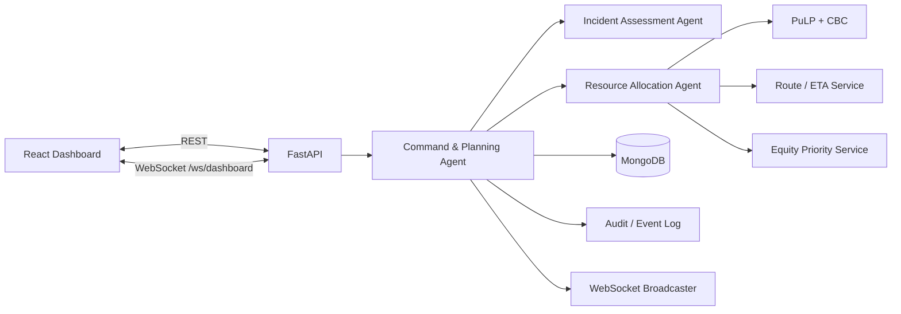
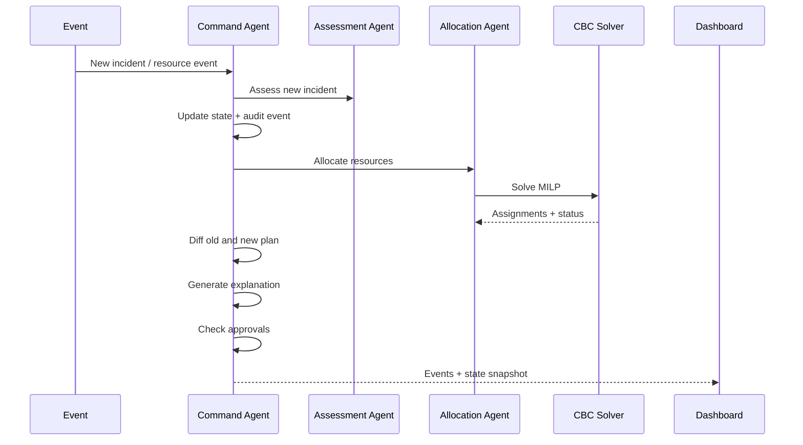

# 🚨 CRISIS COMMAND

### Multi-Agent Emergency Response & Resource Coordination Agent

**GATEWAYS 2026 · Domain 4: Public Safety & Emergency Response**

<p align="center">
  <strong>AI-assisted crisis coordination with mathematical optimization, dynamic replanning, explainable decisions, and human-in-the-loop control.</strong>
</p>

<p align="center">
  
  
  
  
  
  
</p>

<p align="center">
  
  
  
</p>

---

## 📌 Project Overview

**Crisis Command** is an intelligent emergency control-room platform designed to coordinate limited emergency resources across multiple simultaneous incidents.

The platform receives emergency reports through structured inputs or natural-language descriptions, assesses incident severity and resource requirements, calculates resource allocations using **mathematical optimization**, dynamically replans when the crisis state changes, explains why the plan changed, and requests **human approval** when available resources are insufficient.

The central design principle is:

> **AI understands the incident. Mathematics allocates the resources. Humans remain in control of exceptional decisions.**

---

## 🎯 Problem Statement

### Domain 4 — Public Safety & Emergency Response

Emergency situations often involve several incidents occurring simultaneously while response resources remain limited.

Examples include:

- 🚑 Ambulances
- 🚒 Fire teams
- 🛟 Rescue teams
- 🏥 Medical units
- 🏠 Emergency shelters

A crisis can change within seconds when:

- A new high-severity incident arrives.
- Multiple incidents compete for the same resource.
- An assigned unit becomes unavailable.
- A previously unavailable unit returns.
- A resource category becomes exhausted.
- An incident continues waiting for coverage.
- Existing allocations need to be changed.

Traditional static dispatch systems can struggle to continuously adapt to these changing conditions.

Crisis Command addresses this problem through a **multi-agent, optimization-driven, event-based emergency response architecture**.

---

# 💡 Proposed Solution

Crisis Command combines:

```text
Natural Language Understanding
            +
Multi-Agent Coordination
            +
Mathematical Optimization
            +
Real-Time Event Processing
            +
Explainable Replanning
            +
Human-in-the-Loop Approval
```

The system intentionally separates **understanding** from **resource allocation**.

### AI / NLP

The Incident Assessment Agent understands emergency reports and extracts:

- Incident type
- Severity
- Urgency
- Location
- Required resource types
- Confidence

### Optimization

The Resource Allocation Agent uses **PuLP + COIN-OR CBC** to calculate resource assignments subject to operational constraints.

The LLM does **not** directly assign emergency resources.

---

# 🧠 Why Neuro-Symbolic?

Emergency resource allocation is a constrained decision problem.

An LLM is useful for understanding free-form human language, but resource assignment requires deterministic constraints such as:

- Resource availability
- Resource type
- Capability
- One-unit-per-slot restrictions
- Incident priority
- ETA
- Resource competition
- Full incident coverage

Therefore, Crisis Command uses a hybrid approach:

```text
                  EMERGENCY REPORT
                         │
                         ▼
              ┌─────────────────────┐
              │ AI / NLP Layer      │
              │ Incident Assessment │
              └──────────┬──────────┘
                         │
                         ▼
                Structured Incident
                         │
                         ▼
              ┌─────────────────────┐
              │ Optimization Layer  │
              │ PuLP + CBC          │
              └──────────┬──────────┘
                         │
                         ▼
                Resource Allocation
                         │
                         ▼
              ┌─────────────────────┐
              │ Human Oversight      │
              │ Approval / Override  │
              └─────────────────────┘
```

This provides a combination of:

**Probabilistic language understanding + deterministic optimization + human accountability.**

---

# 🏗️ System Architecture



---

# 🤖 Multi-Agent Architecture

Crisis Command uses specialized agents with clearly separated responsibilities.

## 1. Incident Assessment Agent

**File:**

```text
backend/agents/incident_assessment_agent.py
```

### Responsibility

Converts natural-language emergency reports into structured incident information.

The agent identifies:

- Incident type
- Severity
- Urgency
- Location
- Required resource types
- Confidence

The system supports an optional LLM when:

```text
LLM_API_KEY
```

is configured.

When an LLM is unavailable, the system can fall back to configurable deterministic keyword rules:

```text
backend/data/assessment_rules.py
```

This provides a reliable fallback path for demonstrations and offline operation.

---

## 2. Resource Allocation Agent

**File:**

```text
backend/agents/resource_allocation_agent.py
```

### Responsibility

The Resource Allocation Agent performs deterministic resource allocation.

It:

1. Receives assessed incidents.
2. Evaluates available resources.
3. Builds the optimization model.
4. Applies operational constraints.
5. Executes PuLP + CBC.
6. Generates resource assignments.
7. Produces data-backed allocation reasons.

### Important Design Rule

> **The Resource Allocation Agent does not use an LLM to assign resources.**

This prevents generated text from directly making constrained operational assignments.

---

## 3. Command & Planning Agent

**File:**

```text
backend/agents/command_planning_agent.py
```

### Responsibility

The Command & Planning Agent coordinates the overall crisis state.

It:

- Owns global state.
- Handles incidents and resource events.
- Triggers reoptimization.
- Compares old and new plans.
- Generates explanations.
- Detects unresolved shortages.
- Raises human approval requests.
- Writes audit events.
- Broadcasts state changes through WebSocket.

---

# 📐 Mathematical Optimization

**File:**

```text
backend/optimization/resource_optimizer.py
```

The system models emergency resource allocation as a **Mixed Integer Linear Programming (MILP)** problem.

## Resource Slots

A slot represents one required resource type for one incident.

Example:

```text
Incident:
Building Fire

Required Resources:
- Fire Team
- Ambulance
```

This creates two allocation slots.

---

## Decision Variables

### Resource Assignment

```text
x[slot, resource] ∈ {0,1}
```

Determines whether a particular resource is assigned to a particular requirement.

### Incident Coverage

```text
y[incident] ∈ {0,1}
```

Determines whether an incident is fully covered.

---

# 🔒 Hard Constraints

The optimizer enforces strict operational rules.

### Availability

Unavailable and maintenance resources are never considered as candidates.

### Type Matching

The resource type and capability must match the required resource type.

### One Resource Per Slot

A resource cannot satisfy multiple slots simultaneously.

### One Incident Per Resource

A resource cannot be dispatched to multiple incidents at the same time.

### No Fake Resources

The system never creates artificial resources to hide a shortage.

---

# 🎯 Optimization Objective

The optimizer maximizes a weighted objective based on:

```text
Σ x ·
(
    effective_priority
    + urgency × weight
    + base score
    - ETA × weight
    + stability
)
+
completion_bonus × priority × y
```

The objective considers:

- Incident priority
- Urgency
- Estimated arrival time
- Resource stability
- Full incident coverage

If the solver returns a non-optimal failure state, the system raises an optimization error, keeps the previous plan, and records the event in the audit log.

---

# 🚗 Route & ETA Service

The system does not require a paid mapping API.

Distance is calculated using the **Haversine formula**, followed by a configurable road factor and simulated average speed.

```text
Latitude + Longitude
        ↓
Haversine Distance
        ↓
Road Factor
        ↓
Estimated Road Distance
        ↓
Average Speed
        ↓
ETA
```

**File:**

```text
backend/services/route_service.py
```

---

# 🔄 Dynamic Replanning

Crisis Command is designed to react to changing emergency conditions.

Replanning can be triggered by:

- New incident
- Resource failure
- Resource restoration
- Priority changes
- Resource competition
- Resource exhaustion
- Changing incident coverage

### Dynamic Replanning Flow



---

# 🔍 Explainable Replanning

Every important plan change is explainable.

The system compares:

```text
Previous Plan
      ↓
Triggering Event
      ↓
New Plan
      ↓
Reason for Change
```

### Example

```text
WHY DID THE PLAN CHANGE?

Previous:
A01 → Road Accident

Event:
Critical building collapse reported.
A01 became unavailable.

New:
A02 → Building Collapse
A03 → Road Accident

Reason:
A critical incident entered the system while A01
became unavailable. The optimizer recalculated the
allocation under the new resource constraints.
```

This allows emergency coordinators to understand why resources were reassigned.

---

# 👤 Human-in-the-Loop

Crisis Command does not hide resource shortages.

When required resources cannot be fully allocated, the system creates:

```text
HUMAN_APPROVAL_REQUIRED
```

If a resource type has **zero eligible resources anywhere**, the system additionally records:

```text
BOUNDARY_COLLAPSE
```

### No Fake Resources

The system never invents resources to make the plan appear complete.

---

## Approval Endpoints

```http
POST /api/approval/approve
POST /api/approval/reject
```

If an approval has already been decided:

```text
409 Conflict
```

is returned.

Every approval or rejection becomes part of the audit history.

The same unresolved shortage is not repeatedly raised after it has already been reviewed. A changed shortage creates a new approval request, while a shortage that disappears supersedes the previous request.

---

# ⚖️ Equity-Aware Prioritization

Crisis Command incorporates waiting time into incident priority.

```text
effective_priority
=
severity_weight
+
min(
    max_waiting_bonus,
    waiting_coefficient × minutes_waiting
)
```

## Default Severity Weights

| Severity | Weight |
|---|---:|
| Critical | 100 |
| High | 80 |
| Medium | 50 |
| Low | 20 |

## Waiting Configuration

```text
Waiting coefficient: 0.5 points/minute
Maximum waiting bonus: +30
```

These values are configurable in:

```text
backend/config.py
```

Waiting time accumulates while an incident does not have full coverage.

The simulation includes:

```text
Advance +10 min
```

to demonstrate the effect of waiting-time priority.

---

# ⚡ Real-Time Event System

The frontend communicates with the backend through both:

```text
REST
```

and:

```text
WebSocket
```

WebSocket endpoint:

```text
/ws/dashboard
```

Events can include:

```text
incident_created
resource_unavailable
resource_reallocated
plan_recalculated
human_approval_required
boundary_collapse
```

Each event is followed by a:

```text
state_snapshot
```

This allows the dashboard to remain synchronized with the backend crisis state.

---

# 💾 MongoDB Persistence

Crisis Command persists operational state in MongoDB.

Default database:

```text
crisis_command
```

Configuration:

```text
MONGODB_URI
MONGODB_DB
```

The agents operate on in-memory objects, while mutations are serialized by the Command & Planning Agent.

Only changed state is persisted after each operation.

A restart restores:

- Incidents
- Resources
- Current plan
- Plan history
- Approvals
- Audit events
- ID counters
- Simulated clock
- Acknowledged shortages

---

# 🗃️ MongoDB Collections

| Collection | `_id` | Content |
|---|---|---|
| `incidents` | `INC001` | One document per incident |
| `resources` | `A01` | One document per resource |
| `approvals` | `APR001` | Human approval requests |
| `plans` | `PLN003` | Full plans |
| `plan_history` | `PLN003` | Historical plans |
| `events` | `EVT0042` | Append-only audit log |
| `meta` | `state` | Counters, clock and system metadata |

---

# 🛡️ Database Failure Handling

## Startup

The application connects to MongoDB and performs a connectivity check.

If MongoDB is unreachable, the application **fails fast**.

This prevents the system from starting with empty state and accidentally overwriting persistent operational data.

## Runtime Outage

During a database outage:

```text
Operations
    ↓
Continue in memory
    ↓
Database failure logged
    ↓
GET /api/health
    ↓
database.status = "degraded"
```

The next successful write catches up the persisted state.

---

# ❤️ Health Endpoint

```http
GET /api/health
```

Example:

```json
{
  "database": {
    "backend": "mongodb",
    "database": "crisis_command",
    "status": "ok"
  }
}
```

---

# 🧰 Technology Stack

| Layer | Technologies |
|---|---|
| Frontend | React 18, Vite, Tailwind CSS 3, Axios |
| Real-Time | WebSocket |
| Backend | Python 3.10+, FastAPI, Pydantic v2, asyncio |
| AI | Optional LLM + deterministic rule fallback |
| Agents | Incident Assessment, Resource Allocation, Command & Planning |
| Optimization | PuLP + COIN-OR CBC |
| Database | MongoDB 5+, PyMongo |
| Data Processing | Pandas |
| Routing | Haversine + simulated road factor / speed |
| Infrastructure | Docker, Docker Compose |
| API Documentation | FastAPI / Swagger |

---

# 🚀 Installation

## Requirements

Install:

```text
Python 3.10+
Node.js 18+
MongoDB 5+
Git
```

MongoDB may be local or hosted through MongoDB Atlas.

---

## 1. Clone Repository

```bash
git clone https://github.com/balajigs08/CHRIST_HACKATHON.git
cd CHRIST_HACKATHON
```

---

## 2. Configure Environment

```bash
cp .env.example backend/.env
```

Example:

```env
MONGODB_URI=mongodb://localhost:27017
MONGODB_DB=crisis_command
```

If using MongoDB Atlas, replace `MONGODB_URI` with the Atlas connection string.

---

## 3. Optional Docker MongoDB

```bash
docker compose up -d mongo
```

MongoDB data is stored in a named Docker volume.

---

# 🐍 Backend Setup

```bash
cd backend
```

## Windows

```bash
python -m venv .venv
.venv\Scripts\activate
pip install -r requirements.txt
uvicorn main:app --reload --port 8000
```

## Linux / macOS

```bash
python3 -m venv .venv
source .venv/bin/activate
pip install -r requirements.txt
uvicorn main:app --reload --port 8000
```

Backend:

```text
http://localhost:8000
```

API documentation:

```text
http://localhost:8000/docs
```

---

# ⚛️ Frontend Setup

Open another terminal:

```bash
cd frontend
npm install
npm run dev
```

Frontend:

```text
http://localhost:5173
```

The Vite development server proxies:

```text
/api → :8000
/ws  → :8000
```

---

# 🧪 Testing

Run:

```bash
cd backend
pytest -v
```

The test suite does **not require a running MongoDB server**.

Tests use a strict in-memory fake:

```text
tests/fake_mongo.py
```

## Agent Tests

```text
tests/test_agents.py
```

Covers:

- Incident assessment
- Valid allocation
- Invalid allocation
- Resource conflicts
- Prioritization
- Waiting-time equity
- Optimization failure
- Dynamic replanning
- Zero-resource situations
- Approvals
- Explanations

## API Tests

```text
tests/test_api.py
```

Covers:

- REST endpoints
- WebSocket behavior

## Persistence Tests

```text
tests/test_persistence.py
```

Covers:

- Restart / restore
- ID continuity
- Reset
- Database outage
- Fail-fast startup

---

# 🎬 Demonstration Scenario

Crisis Command includes a complete simulation designed to demonstrate dynamic emergency response.

## Step 1 — Load T = 0

The system starts with:

```text
🚗 Road Accident     → High
🔥 Building Fire     → Critical
🏥 Medical Incident  → Medium
```

The optimizer assigns available resources.

Example resources include:

```text
A01
A02
A03
F01
```

The exact assignments are determined by the optimization model rather than hardcoded rules.

---

## Step 2 — Advance to T + 10

A new critical incident arrives:

```text
🏢 Building Collapse
```

At the same time:

```text
A01 → unavailable
```

The system:

1. Updates the state.
2. Recalculates priorities.
3. Rebuilds the optimization model.
4. Runs CBC.
5. Generates a new allocation.
6. Compares the previous and new plans.
7. Explains the reason for reassignment.
8. Updates the event timeline.
9. Requests human approval if resources are insufficient.

---

## Step 3 — Human Approval

If four incidents require ambulances while only two remain available:

```text
HUMAN_APPROVAL_REQUIRED
```

appears.

The operator can:

```text
APPROVE
```

or:

```text
REJECT
```

The decision is recorded in the audit log.

---

## Step 4 — Restore Resource

When:

```text
A01 → available
```

the optimizer runs again.

The shortage may shrink or disappear.

A previous unresolved approval is superseded when the shortage condition changes.

---

# 🖥️ Free-Text Incident Assessment

The dashboard supports natural-language emergency reports.

Example:

```text
There is a major fire in a commercial building near
the city center. Several people may be trapped.
```

The Incident Assessment Agent converts the report into structured information:

```text
Type:
Building Fire

Severity:
Critical

Urgency:
High

Required Resources:
Fire Team
Ambulance

Location:
Extracted / assessed location

Confidence:
Validated output
```

The structured incident is then passed to the optimization layer.

---

# 🌐 REST API

## Health

```http
GET /api/health
```

## Incidents

```http
GET  /api/incidents
POST /api/incidents
```

## Resources

```http
GET  /api/resources
POST /api/resources
```

## Plans

```http
GET /api/plan
GET /api/plan/history
```

## Events

```http
GET /api/events
```

## Approvals

```http
GET /api/approvals
POST /api/approval/approve
POST /api/approval/reject
```

## State

```http
GET /api/state
```

---

# 🎮 Simulation API

```http
POST /api/simulation/incident
POST /api/simulation/break-ambulance
POST /api/simulation/restore-ambulance
POST /api/simulation/advance
POST /api/simulation/demo-t0
POST /api/simulation/demo-t10
POST /api/simulation/reset
```

---

# 📦 API Error Format

All API errors follow:

```json
{
  "error": {
    "code": "ERROR_CODE",
    "message": "Human-readable explanation"
  }
}
```

---

# 📁 Project Structure

```text
CHRIST_HACKATHON/
│
├── backend/
│   ├── main.py
│   ├── config.py
│   ├── api/
│   │   └── routes.py
│   │
│   ├── agents/
│   │   ├── incident_assessment_agent.py
│   │   ├── resource_allocation_agent.py
│   │   ├── command_planning_agent.py
│   │   └── llm_client.py
│   │
│   ├── optimization/
│   │   └── resource_optimizer.py
│   │
│   ├── services/
│   │   ├── state_store.py
│   │   ├── route_service.py
│   │   ├── priority_service.py
│   │   ├── plan_diff.py
│   │   ├── simulation_service.py
│   │   ├── clock.py
│   │   └── container.py
│   │
│   ├── events/
│   │   ├── event_log.py
│   │   └── ws_manager.py
│   │
│   ├── models/
│   │   ├── schemas.py
│   │   └── errors.py
│   │
│   ├── db/
│   │   └── mongo.py
│   │
│   ├── data/
│   ├── utils/
│   └── tests/
│
├── frontend/
│   ├── src/
│   │   ├── pages/
│   │   ├── components/
│   │   ├── hooks/
│   │   ├── services/
│   │   └── types/
│   │
│   ├── vite.config.js
│   └── tailwind.config.js
│
├── .env.example
├── .gitignore
├── docker-compose.yml
└── README.md
```

---

# ⚠️ Known Limitations

The current implementation has several deliberate limitations:

- Single backend process.
- State is loaded from MongoDB into memory at startup.
- Run exactly one backend instance.
- No real-time traffic routing provider.
- ETA uses Haversine distance, road factor and simulated speed.
- LLM path requires an API key and is optional.
- Rule-based assessment fallback is available.
- WebSocket fan-out is single-process.
- Resources are currently modeled as whole units.
- Partial resource capacity is not currently modeled.

---

# 🛣️ Future Roadmap

## Phase 1 — Intelligent Assessment

- [x] Free-text incident assessment
- [x] Rule-based fallback
- [x] Structured incident extraction
- [x] Confidence validation

## Phase 2 — Optimization

- [x] MILP resource allocation
- [x] CBC solver
- [x] Hard resource constraints
- [x] ETA-aware optimization
- [x] Stability-aware planning

## Phase 3 — Dynamic Crisis Management

- [x] Live replanning
- [x] Resource failure handling
- [x] Resource restoration
- [x] Plan diff
- [x] Audit events

## Phase 4 — Human Oversight

- [x] Human approval requests
- [x] Approval / rejection workflow
- [x] Boundary collapse detection
- [x] Shortage supersession

## Future Enhancements

- [ ] Real emergency GIS integration
- [ ] Live traffic-aware ETA
- [ ] Predictive incident escalation
- [ ] Multi-city crisis coordination
- [ ] Advanced resource capacity modeling
- [ ] Role-based access control
- [ ] Production authentication
- [ ] Cloud-native deployment
- [ ] Distributed event processing
- [ ] Advanced crisis analytics

---

# 🔐 Security Considerations

A production deployment should include:

- Role-Based Access Control
- Secure authentication
- API authorization
- Encrypted communication
- Secrets management
- Input validation
- Rate limiting
- Secure WebSocket connections
- Audit trail protection
- Database access controls

---

# 📊 What Makes Crisis Command Different?

Many conventional systems focus on dispatching resources using fixed rules.

Crisis Command combines several layers:

```text
Natural Language Understanding
              +
Specialized AI Agents
              +
Mathematical Optimization
              +
Dynamic Replanning
              +
Equity-Aware Prioritization
              +
Explainable Decisions
              +
Human Approval
              +
Persistent Operational State
```

The system therefore does not simply answer:

> "What should happen?"

It continuously evaluates:

> **What is happening now, what resources are available, what has changed, what can be allocated under the constraints, and when does a human need to intervene?**

---

# 🧭 Design Philosophy

> **Understand with AI.**
>
> **Optimize with mathematics.**
>
> **Replan when the situation changes.**
>
> **Explain every important decision.**
>
> **Keep humans in control.**

---

# 🏆 GATEWAYS 2026

## Round 1 — Ideation & Architecture

**Domain:** Domain 4 — Public Safety & Emergency Response

**Project:** Crisis Command — The Multi-Agent Emergency Response & Resource Coordination Agent

**Architecture:** Neuro-Symbolic Multi-Agent System

**Optimization:** PuLP + COIN-OR CBC

**Frontend:** React + Vite + Tailwind CSS

**Backend:** FastAPI + Python

**Database:** MongoDB

**Real-Time Communication:** WebSocket

---

# 👥 Team

| Name | Registration Number | Role |
|---|---|---|
| **Balaji G S** | **NB25MCA010** | Frontend & Dashboard Developer |
| **Mohammed Wazer** | **NB25MCA027** | Backend & Multi-Agent Developer |
| **Abhishek Ashok Kokkari** | **NB25MCA002** | AI/Optimization & Data Engineer |

---

# 📜 License

This project is developed as part of **GATEWAYS 2026**.

Licensed under the MIT License.

---

<p align="center">

# 🚨 CRISIS COMMAND

### From emergency signals to coordinated action.

**AI-Assisted · Optimization-Driven · Explainable · Human-Controlled**

</p>
