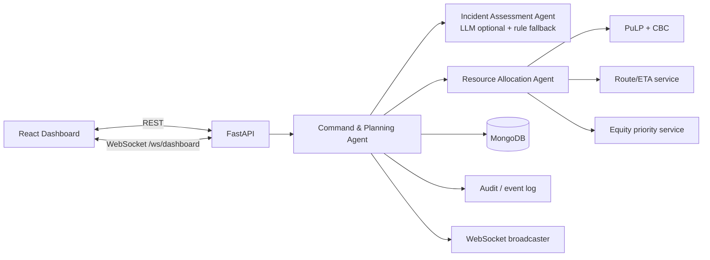
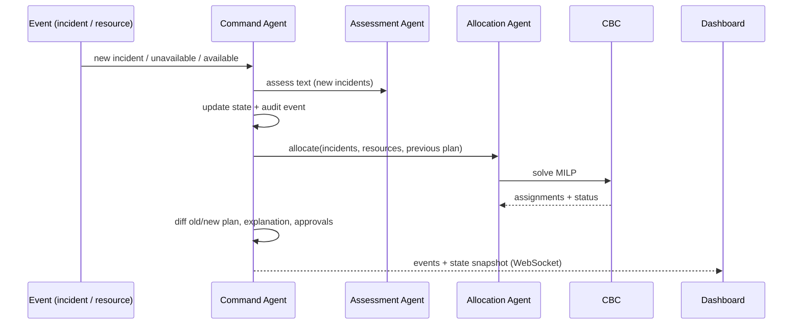

# CRISIS COMMAND
### Multi-Agent Emergency Response & Resource Coordination Agent
GATEWAYS 2026 · Domain 4: Public Safety & Emergency Response

## 1. Overview
An emergency control-room system that receives incidents (free text), assesses severity and needs, allocates limited
resources with **mathematical optimization**, **replans live** when the situation changes, explains every change, and
asks a human for approval when resources run out.

## 2. Problem
Several emergencies happen at once while ambulances, fire teams, rescue teams, medical units and shelters are limited.
The plan must react when a critical incident arrives, a unit breaks down or comes back, incidents compete for the same unit,
or a resource type is exhausted.

## 3. Architecture (neuro-symbolic)
The LLM/NLP layer only *understands text* and *never assigns resources*. Assignment is solved by PuLP + CBC.



## 4. Tech stack
React 18 · Vite · Tailwind 3 · Axios · WebSocket | Python 3.10+ · FastAPI · Pydantic v2 · asyncio | PuLP + COIN-OR CBC | MongoDB (PyMongo) | Pandas (available for data work) | no paid map API (haversine + simulated speed).

## 5. Agents
| Agent | File | Responsibility |
|---|---|---|
| Incident Assessment | `agents/incident_assessment_agent.py` | text → type, severity, urgency, location, required resource **types**, confidence. Uses an LLM if `LLM_API_KEY` is set (output validated), otherwise configurable keyword rules (`data/assessment_rules.py`). |
| Resource Allocation | `agents/resource_allocation_agent.py` | **No LLM.** Runs the optimizer, builds assignments with a data-backed reason each. |
| Command & Planning | `agents/command_planning_agent.py` | Owns global state, handles events, triggers reoptimization, diffs plans, writes explanations, raises approvals, emits audit events, broadcasts over WebSocket. |

## 6. Optimization approach (`optimization/resource_optimizer.py`)
A *slot* is one required resource type of one incident. Binary `x[slot,resource]`, binary `y[incident]` (fully covered).
* **Hard constraints:** unavailable/maintenance units are never candidates; type and capability must match; one unit per slot; one incident per unit.
* **Objective (maximise):** `Σ x·(effective_priority + urgency·w + base − ETA·w + stability) + completion_bonus·priority·y`.
* Non-optimal solver status → `OptimizationError`, previous plan is kept and an audit event is written.
* Distances: haversine × road factor; ETA from average speed (`services/route_service.py`).

## 7. Dynamic replanning flow


## 8. Human-in-the-loop
If any required resource cannot be covered, the plan gets an **Approval** (`HUMAN_APPROVAL_REQUIRED`); if a type has zero eligible units anywhere, `BOUNDARY_COLLAPSE` is also logged. No fake resource is ever created.
`POST /api/approval/approve|reject` (409 if already decided) → audit event. The same unresolved shortage is not re-raised after a decision; a changed shortage raises a new request; a shortage that disappears supersedes the old request.

## 9. Equity-aware prioritization
`effective_priority = severity_weight + min(max_waiting_bonus, waiting_coefficient × minutes_waiting)`.
Defaults: critical 100, high 80, medium 50, low 20; 0.5 pts/min, max +30. All in `backend/config.py` (env-overridable). Waiting accrues while an incident lacks full coverage. Use **Advance +10 min** to see it work.

## 10–11. Installation & environment
Requirements: Python 3.10+, Node 18+, **MongoDB 5+** (local or Atlas).
```bash
cp .env.example backend/.env        # set MONGODB_URI if it is not mongodb://localhost:27017
docker compose up -d mongo          # optional: starts a local MongoDB (data kept in a named volume)
```
## 12. Run backend
```bash
cd backend
python -m venv .venv && source .venv/bin/activate      # Windows: .venv\Scripts\activate
pip install -r requirements.txt
uvicorn main:app --reload --port 8000                  # API docs: http://localhost:8000/docs
```
## 13. Run frontend
```bash
cd frontend
npm install
npm run dev                                            # http://localhost:5173 (proxies /api and /ws to :8000)
```
## 14. Tests
```bash
cd backend && pytest -v
```
Tests need **no MongoDB server**: they run against a strict in-memory fake (`tests/fake_mongo.py`).
`tests/test_agents.py` (assessment, valid/invalid allocation, conflicts, prioritization, waiting-time equity, failure, dynamic replanning, zero-resource, approvals, explanations) and `tests/test_api.py` (REST + WebSocket) and `tests/test_persistence.py` (restart/restore, id continuity, reset, outage, fail-fast startup).

## 15. Demo scenario
1. Open the dashboard → **1 · Load T=0** (road accident High, building fire Critical, medical Medium). CBC assigns A01/A02/A03 + F01.
2. **2 · T+10** — a critical building collapse arrives *and* A01 breaks. The plan is recomputed, **Why did the plan change?** shows previous → event → new + reasons, the timeline logs it, and because 4 incidents need ambulances but only 2 remain, **Human Approval** appears.
3. Approve/Reject → audit log updated. **Restore Ambulance** → shortage shrinks/supersedes.
The exact assignments come from the optimizer, not from hardcoded rules. You can also type any report in the box (“Assess & Dispatch”).

## 16. Structure
```
backend/  main.py  config.py  api/routes.py
          agents/{incident_assessment,resource_allocation,command_planning}_agent.py  llm_client.py
          optimization/resource_optimizer.py
          services/{state_store,route_service,priority_service,plan_diff,simulation_service,clock,container}.py
          events/{event_log,ws_manager}.py  models/{schemas,errors}.py  db/mongo.py  data/  utils/  tests/
frontend/ src/{pages,components,hooks,services,types}  vite/tailwind config
```

## Database (MongoDB)
State is persisted in MongoDB (`MONGODB_URI`, `MONGODB_DB`, default `crisis_command`). The agents still work on in-memory objects
(all mutations are serialised by the command agent's lock); `db/mongo.py` restores them at startup and writes back **only what changed**
at the end of every operation. A restart therefore resumes exactly where the control room left off: incidents, resources, current plan,
plan history, approvals (including already-reviewed shortages), audit log, id counters and the simulated clock.

| Collection | `_id` | Content |
|---|---|---|
| `incidents`, `resources`, `approvals` | `INC001`, `A01`, `APR001` | one document per entity |
| `plans` / `plan_history` | `PLN003` | every full plan / one entry per replanning (append-only) |
| `events` | `EVT0042` | append-only audit log |
| `meta` | `state` | id counters, acknowledged shortages, clock offset, current plan id |

* **Startup** connects and pings MongoDB and **fails fast** if it is unreachable (so the app can never start empty and overwrite real data).
* **Outage while running:** operations keep working in memory, the failure is logged, `GET /api/health` reports `database.status = "degraded"`,
  and the next successful write catches up automatically.
* **Reset** (`POST /api/simulation/reset`) clears the collections and re-seeds the 8 demo resources.
* Health: `GET /api/health` -> `"database": {"backend": "mongodb", "database": "crisis_command", "status": "ok"}`.

## REST/WS reference
Required endpoints are all implemented (`/api/health`, incidents, resources, plan, events, approval, `/ws/dashboard`).
Extras: `GET /api/state`, `GET /api/approvals`, `GET /api/plan/history`, `POST /api/simulation/{incident,break-ambulance,restore-ambulance,advance,demo-t0,demo-t10,reset}`.
WebSocket sends one message per event (`incident_created`, `resource_unavailable`, `resource_reallocated`, `plan_recalculated`, `human_approval_required`, `boundary_collapse`, …) followed by a `state_snapshot`.
Errors are always `{"error": {"code", "message"}}`.

## Known limitations
Single backend process (state is loaded from MongoDB into memory at startup and written back after every operation, so run exactly one instance); no real routing; LLM path untested without a key; single-process WebSocket fan-out; incidents are served by whole units of a type (no partial capacity).
